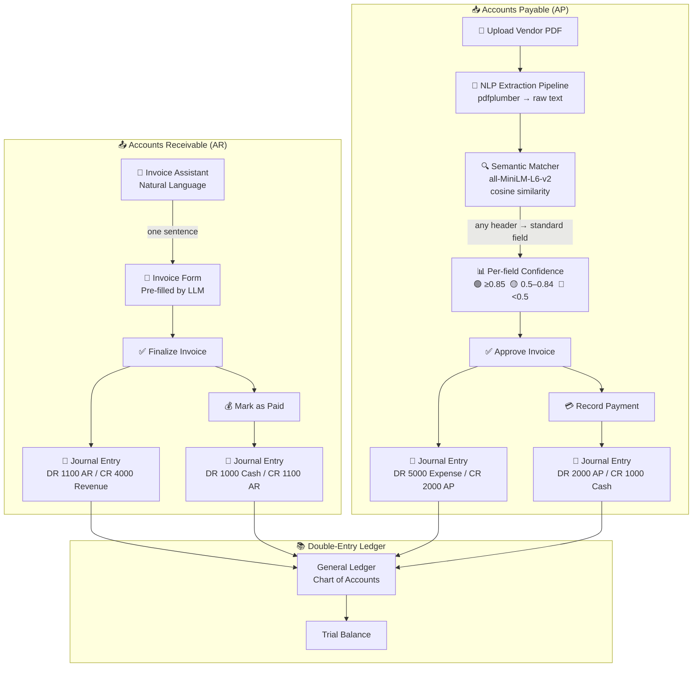

# LinkedIn Video Plan 2 — SmartInvoice Demo
**Target: ~4:45 mins**

---

## System Architecture



---

## Video Script

---

### SECTION 1 — Hook (0:00–0:30)
**Show:** SmartInvoice dashboard open in browser

> *"Most invoice tools are just data entry forms. You fill in the fields, you click save. What if you could just... talk to it? Or hand it a PDF and have it figure everything out? That's what I built — let me show you."*

---

### SECTION 2 — Quick Project Overview (0:30–1:00)
**Show:** Slowly scroll through the navbar — Dashboard → Invoices → Payables → Accounting → Forecasting

> *"SmartInvoice is a full-stack invoice management system — React frontend, FastAPI backend, deployed on AWS. It handles both sides of the money: invoices you send out — Accounts Receivable — and bills you receive — Accounts Payable. Everything flows into a real double-entry ledger. And there's AI at the center of it."*

---

### SECTION 3 — Create Invoice via Natural Language (1:00–2:15)
**Show:** Click the floating **Invoice Assistant** button (bottom right)

> *"Let's start with AR — creating an invoice. Instead of filling out a form, I'm going to describe what I want."*

**Type in chat:** `"Create an invoice for Acme Corp for 3 units of web design at $500 each"`

**Show:** Watch the assistant respond and populate the form fields automatically

> *"The LLM parses the request — extracts the customer, the line items, quantity, price — and pre-fills the entire invoice form. See that blue banner — 'Pre-filled from your request.' I just review it, make any edits, and hit Create."*

**Show:** Click **Create Invoice** → invoice appears in list

> *"One sentence. Full invoice. That's the AR side."*

---

### SECTION 4 — Finalize to Ledger (2:15–2:45)
**Show:** Open that invoice → click **Finalize → Ledger**

> *"Now here's where it gets interesting. When I finalize this invoice, the system automatically posts a double-entry journal entry — Debit Accounts Receivable, Credit Revenue. No manual bookkeeping."*

**Show:** Navigate to **Accounting** → show the journal entry that just appeared

> *"There it is. DR 1100, CR 4000. Clean double-entry, posted automatically."*

---

### SECTION 5 — How the Semantic Extraction Works (2:45–3:30)
**Show:**
1. Open `ml-extractor/semantic_matcher.py` in VS Code
2. Show the `STANDARD_FIELDS` dict — 32 fields with aliases
3. Zoom into `match_header()` — the core matching logic
4. Switch to terminal and run:

```bash
cd ml-extractor
python -c "
from semantic_matcher import SemanticMatcher
m = SemanticMatcher()
tests = ['Cant/Qty', 'Todo incluido', 'Fecha', 'Balance Due', 'Pay By']
for h in tests:
    field, score = m.match_header(h)
    print(f'{h:25} → {field:20} ({score:.0%} confidence)')
"
```

**Show:** Output mapping foreign/weird headers to standard fields

> *"Now the AP side — receiving vendor invoices. Instead of hardcoding field names, we use a sentence transformer model — all-MiniLM-L6-v2 — to embed both the invoice headers and our 32 standard field names into vector space. Then we find the closest match using cosine similarity. It doesn't care what the column is called — it understands what it means. 'Cant/Qty' maps to quantity at 91%. 'Fecha' maps to invoice date at 94%. 'Todo incluido' maps to description at 87%. No training data. No YAML config. Works out of the box."*

---

### SECTION 6 — AP Invoice Import + Confidence UI (3:30–4:15)
**Show:** Navigate to **Payables → Invoices** → click Upload

> *"Now the AP side — this is the main feature I want to highlight. I'm going to upload a vendor invoice PDF — a real one,different format, different layout."*

**Show:** Upload `pinnacle_mktg_PMG-INV-2026-0017.pdf`

> *"The system sends this PDF through an NLP extraction pipeline — no templates, no hardcoded rules for specific vendors.It extract the raw text, the semantic matcher maps every header to our standard schema, and the result lands here — fully populated."*

**Show:** Invoice detail page — point to each extracted field

> *"Look at these confidence scores under each field — green means high confidence, the extractor is sure. Yellow means review it. Red means it couldn't find it and I should fill it manually."*

**Show:** Scroll down to line items — green `conf: 1.0` on each row

> *"Even the line items — description, quantity, unit price, total — each one scored individually. This tells me exactly how much I can trust the extraction before I approve anything."*

**Show:** Click **Approve** → navigate to **Accounting** → show AP journal entry

> *"One click to approve, and again — journal entry posted automatically. Debit Expenses, Credit Accounts Payable."*

---

### SECTION 7 — Close (4:15–4:45)
**Show:** Pull back to Dashboard — show the overview cards

> *"So in under 5 minutes — an invoice created from a sentence, a vendor bill extracted from a PDF with per-field confidence scoring, and both posted to a real ledger automatically. The goal was to eliminate manual data entry completely. I think we're close."*

> *"Stack is React, FastAPI, deployed on AWS Lambda with CloudFront. If you're building something similar or want to talk about AI-powered document extraction — drop a comment or connect."*

---

## Quick Cheat Sheet

| Step | Prep |
|---|---|
| Chat invoice | Have the Invoice Assistant open and ready |
| AP upload | Use `pinnacle_mktg_PMG-INV-2026-0017.pdf` — it extracts cleanly |
| Terminal demo | `cd ml-extractor` with venv activated, test script ready to paste |
| VS Code | `semantic_matcher.py` open, `STANDARD_FIELDS` and `match_header()` visible |
| Ledger | Clear duplicate journal entries first so the new ones stand out |
| Speed | Talk slightly slower than feels natural — screen demos look rushed |

---

## Screen Recording Setup

| Setting | Recommendation |
|---|---|
| Resolution | 1920×1080 (16:9) |
| Browser zoom | 110% |
| VS Code font | 16+ so code is readable on phones |
| Terminal font | Large — audience watches on phones |
| Recording tool | QuickTime (Mac) → export MP4 |
| Captions | Add via LinkedIn's built-in auto-caption after upload |

---

## LinkedIn Post Copy

```
Built an AI that processes invoices from ANY vendor — without configuration.

Two things I want to show:

1/ Create an invoice from a single sentence
   "Invoice Acme Corp, 3 units web design at $500"
   → Form pre-filled. Journal entry posted. Done.

2/ Upload any vendor PDF — it figures it out
   Using sentence-transformers (all-MiniLM-L6-v2), we map arbitrary invoice
   headers to 32 standard fields via cosine similarity.
   No templates. No YAML configs. No retraining.

   "Cant/Qty"      → quantity      (91%)
   "Fecha"         → invoice_date  (94%)
   "Todo incluido" → description   (87%)
   "Balance Due"   → total_amount  (96%)

   Per-field confidence scores tell you exactly what to review before approving.
   Everything flows into double-entry accounting automatically.

Model runs locally. No API cost per document.

Built with: FastAPI · React · pdfplumber · sentence-transformers · AWS Lambda

#AI #NLP #FinTech #InvoiceAutomation #MachineLearning #Python #React
```

---

## Key Technical Points (mention 1–2 max, don't go deep)
- Model is a singleton — loaded once per Lambda container, not per request
- Threshold configurable (default 0.50) — tune precision vs recall
- Falls back from table extraction → regex if PDF has no structured tables
- Confidence score = ratio of key fields successfully extracted
